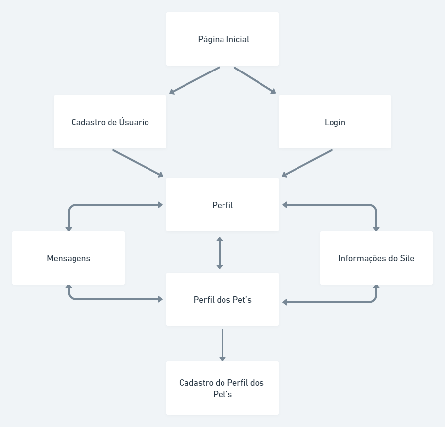
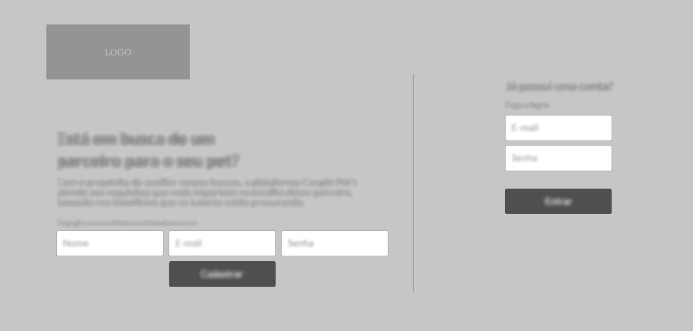
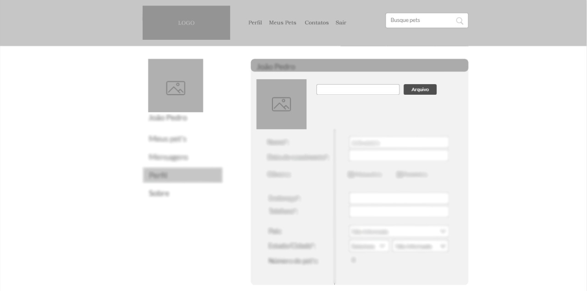
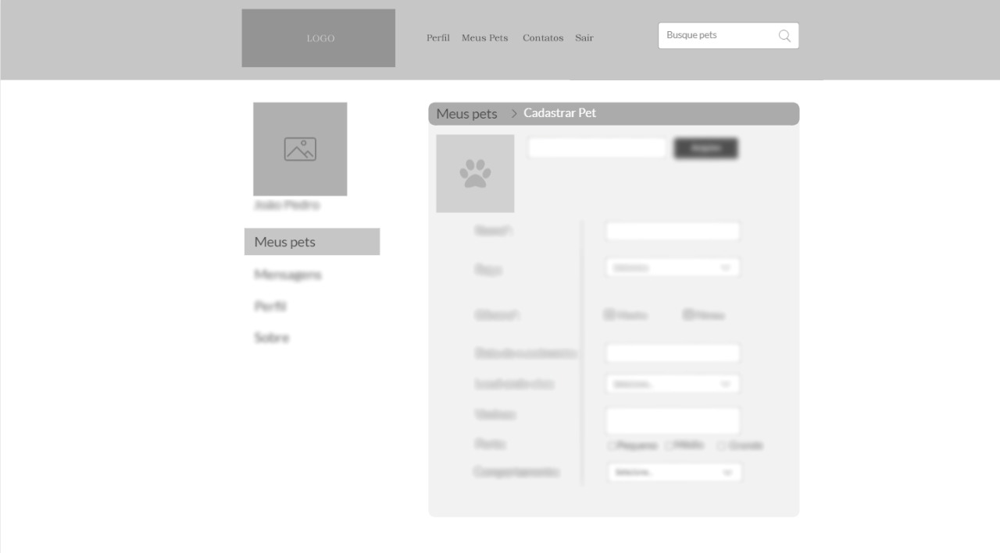
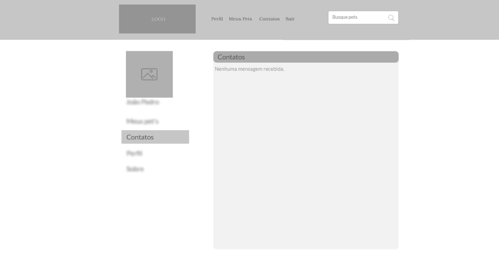
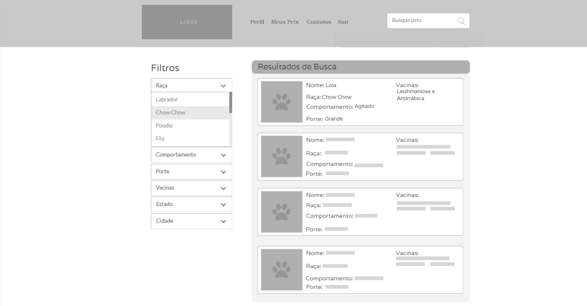
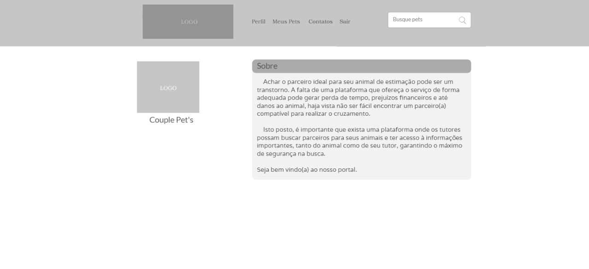

# Projeto de Interface

Pré-requisitos: <a href="2-Especificação do Projeto.md"> Documentação de Especificação</a>

Dentre as preocupações para a montagem da interface do sistema, estamos estabelecendo foco em questões como agilidade, acessibilidade e usabilidade. Desta forma, o projeto tem uma identidade visual padronizada em todas as telas que são projetadas para funcionamento em desktops e dispositivos móveis.

## Fluxo do Usuário

Fluxo de usuário (User Flow) é uma técnica que permite ao desenvolvedor mapear todo fluxo de telas do Site ou APP. Essa técnica funciona para alinhar os caminhos e as possíveis ações que o usuário pode fazer junto com os membros da equipe.

O diagrama apresentado na Figura X mostra o fluxo de interação do usuário pelas telas do sistema. Cada uma das telas deste fluxo é detalhada na seção de Wireframes que se segue. 

## Wireframes

São protótipos usados em design de interface para sugerir a estrutura de um site web e seu relacionamentos entre suas páginas. Um wireframe web é uma ilustração semelhante do layout de elementos fundamentais na interface. Segue link para teste. (https://marvelapp.com/start-user-test/xmTZMDZMvLJiOmxJQoMA)

01- Homepage do site

02- Perfil do Usuario

03- Cadastro do Pet

04- Contatos

05- Resultado das buscas pelos pets

06- Sobre o Site

