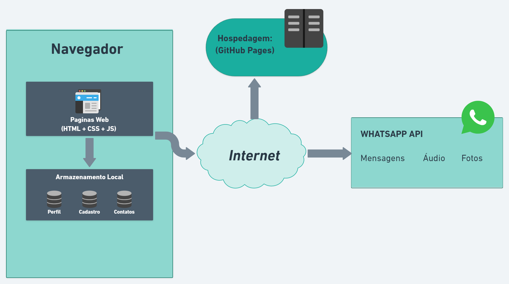

# Arquitetura da Solução

Nesta seção são apresentados os detalhes técnicos da solução criada pela equipe, tratando dos componentes que fazem parte da solução e do ambiente de hospedagem da solução.

## Diagrama de componentes

Diagrama que permite a modelagem física de um sistema, através da visão dos seus componentes e relacionamentos entre os mesmos.

Exemplo: 

Os componentes que fazem parte da solução são apresentados na Figura abaixo.

Arquitetura da Solução

A solução implementada conta com os seguintes módulos:
- **Navegador** - Interface básica do sistema  
  - **Páginas Web** - Conjunto de arquivos HTML, CSS, JavaScript e imagens que implementam as funcionalidades do sistema.
   - **Local Storage** - armazenamento mantido no Navegador, onde são implementados bancos de dados baseados em JSON. São eles: 
     - **Perfil** - seção que mostra as informações do usuário.
     - **Cadastro** - registro de dados cadastrais de cada usuário.
     - **Contatos** - lista de perfis encontrados que despertaram interesse.
 - **WhatsApp API** - plataforma que permite o redirecionamento do usuário para troca de mensagens pelo WhatsApp.
 - **Hospedagem** - GitHub Pages.
## Tecnologias Utilizadas

As tecnologias utilizadas foram: CSS, HTML, JavaScrip, WhatAapp API, MARVEL, Whimsical, Visual Studio Code, GitHub Pages.

## Hospedagem

Hospedamos o site no GitHub Pages, o que facilita o desenvolvimento por conta da integração do GitHub Pages com nosso repositório. Segue o link para o site: (https://icei-puc-minas-pmv-ads.github.io/pmv-ads-2022-1-e1-proj-web-t1-couple-pets/).

