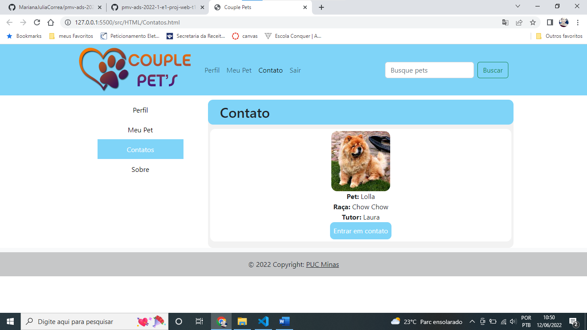
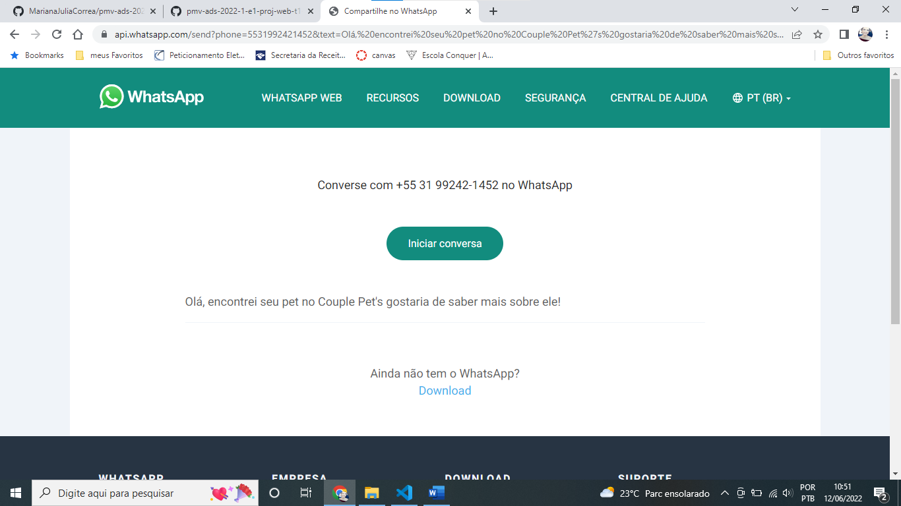
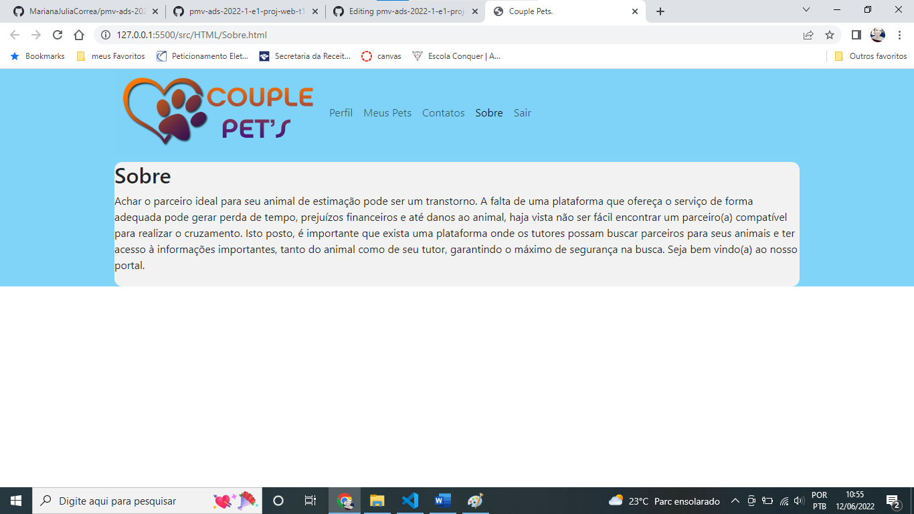

Registro de Testes de Software
Os resultados obtidos nos testes de software realizados são descritos na Tabela a seguir.

● Site publicado na Internet

● Navegador da Internet – Chrome e Edge

Os testes funcionais a serem realizados no aplicativo são descritos a seguir.

|  **Caso de Teste**  |  **CT-01  - Visualizar Página Inicial**  |
|--|--|
|Requisitos Associados:  |RF-01 - O site deve apresentar na página principal o local para cadastro de novo usuário e para login dos usuários já cadastrados.  | 
|Objetivo do Teste:  | Acessar a página Inicial.  | 
|Passos:  | 1) Acessar o Navegador  
||2) Informar o endereço do Site  
||3) Visualizar a página inicial  |
|Resultado:  | Aplicação concluída com sucesso|
|Evidência:  |  

 |  **Caso de Teste**  |  **CT-02 - Visualizar perfil do usuário**  |
|--|--|
|Requisitos Associados:	|RF-02 - O site deve permitir ao usuário visualizar seu perfil  |
|Objetivo do Teste:	 |Verificar se os dados do perfil do usuário estão condizentes com as informações prestadas pelo usuário.  |
|Passos:	 |1) Visualizar a página inicial
||2) Inserir usuário e senha nos campos determinados para usuario já cadastrado
||3) Acessar perfil do usuário
|Resultado:  | Aplicação concluída com sucesso|
|Evidência:  | |

|  **Caso de Teste**  |  **CT-03 - Visualizar cadastro do  usúario**  |
|--|--|
|Requisitos Associados:	|RF-03 - O site deve permitir ao usuário visualizar a pagina de cadastro do site  |
|Objetivo do Teste:	 |Possibilitar o cadastro do usuário com a inserção de informações prestadas por ele para a conclusão de seu perfil  |
|Passos:	 |1) Visualizar a página inicial
||2) Inserir usuário e senha nos campos determinados para o inicio de seu cadastro 
||3) Acessar perfil de cadastro de informações do usuario e preencher com as informações
||4) Concluir cadastro do Usuario
|Resultado:  | Passos 1 e 2 realizados com sucesso , Passos 3 e 4 não responsivo|
|Evidência:  | |

|  **Caso de Teste**  |  **CT-04 – Cadastro de pet**  |
|--|--|
|Requisitos Associados:	|RF-04 - O site deve permitir ao usuário cadastrar seu pet com o preenchimento de informações sobre o animal  |
|Objetivo do Teste:	 |Possibilitar o cadastro do pet do usuario com a inserção de informações prestadas pelo usuario para a conclusão do perfil do pet|
|Passos:	 |1) Visualizar a página principal
||2) Inserir usuário e senha nos campos determinados
||3) Acessar perfil do usuário
||4) Acessar cadastro de pet
||5) realizar cadastro do pet
||6) concluir cadastro do pet
|Resultado:  |Passos 1, 2 e 3 realizados com sucesso , Passos 4, 5 e 6 não responsivo|
|Evidência:  | |

|  **Caso de Teste**  |  **CT-05 – Resultado de pesquisa de pet**  |
|--|--|
|Requisitos Associados:	|RF-05 - O site deve permitir ao usuário visualizar o perfil do pet idealizado  |
|Objetivo do Teste:	 |Possibilitar a visualização do perfil do pet pesquisado com as informações pertinentes|
|Passos:	 |1) Visualizar a página principal
||2) Inserir usuário e senha nos campos determinados
||3) Acessar perfil do usuário
||4) Acessar busca de pet
||5) encontrar pet idealizado
||6) acessar perfil do pet
|Resultado:  |Passos 1, 2 e 3 realizados com sucesso , Passos 4, 5 e 6 não responsivo|
|Evidência:  ||

|  **Caso de Teste**  |  **CT-06 – Enviar mensagem para perfil encontrado**  |
|--|--|
|Requisitos Associados:	|RF-06 - O site deve permitir ao usuário enviar mensagem para o perfil encontrado através de um link para o WhatsApp.  |
|Objetivo do Teste:	 |Verificar se o link de acesso de WhatsApp é funcional e remete o usuário para o aplicativo de WhatsApp possibilitando iniciar a conversa com o outro usuário do site.  |
|Passos:	 |1) Visualizar a página inicial
||2) Inserir usuário e senha nos campos determinados
||3) Acessar perfil do usuário
||4) clicar no perfil selecionado e visualizar o perfil do pet encontrado
||5) visualizar link para o envio de mensagens
||6) acessar link e ser direcionado para o app WhatsApp do tutor do pet encontrado
|Resultado:  |Aplicação concluída com sucesso|
|Evidência:  |  |

|  **Caso de Teste**  |  **CT-07 – Visualizar pagina Sobre**  |
|--|--|
|Requisitos Associados:	|RF-07 - O site deve permitir ao usuário acessar a pagina sobre e visulaizar as informações sobre a utlidade do site |
|Objetivo do Teste:	 |Possibilitar o usuario encontrar informações sobre o site e qual sua utilidade para o mesmo |
|Passos:	 |1) Visualizar a página inicial
||2) Inserir usuário e senha nos campos determinados
||3) Acessar perfil do usuário
||4) acessar a pagina sobre
||5) visualizar a pagina contendo informações sobre o site
|Critérios de Êxito:  |A página se comportará como esperado e surgirá a descrição com informações sobre o sit|Resultado:  |Aplicação concluída com sucesso|
|Evidência:  ||

|  **Caso de Teste**  |  **CT-08 – Responsividade do site**  |
|--|--|
|Requisitos Associados:	|RF-08 - O site deve permitir ao usuário acessar as paginas do site de forma responsiva |
|Objetivo do Teste:	 |Possibilitar o usuario a adaptação a qualquer ferramenta que estejam usando para facilitar a visualização do site |
|Passos:	 |1) Visualizar a página inicial
||2) diminuir a tela do navegador
||3) visualizar a pagina do site de maneira eficiente funcional e inteligível
|Critérios de Êxito:  |A página se comportará como esperado e surgirá a descrição com informações sobre o sit|Resultado:  |Aplicação concluída com sucesso|
|Evidência:  |

| **Caso de Teste** | **CT-09 – O Site Apresentar Navegabilidade** | 
|--|--| 
|Requisitos Associados:	|RF-02 - O site deve ser intuitivo. | 
|Objetivo do Teste:	 |Verificar se as páginas apresentam uma navegabilidade que possa mostrar ao usuário de onde ele veio, como voltar e qual passo dar a seguir.  | 
|Passos:	 |1) Acessar qualquer página do site. 
||2) Verificar a disponibilidade dos botões e se são funcionais.
||3) Verificar o desempenho ao buscar informações dentro da página. 
||4) Verificar se há organização das informações disponíveis para que haja uma navegação de forma intuitiva.
|Critérios de Êxito:  |Deve organizar as informações disponíveis para que o visitante navegue de forma intuitiva e saiba de onde ele veio, como voltar e qual passo dar a seguir.|Resultado:  |Aplicação concluída com sucesso|
|Evidência:  |

