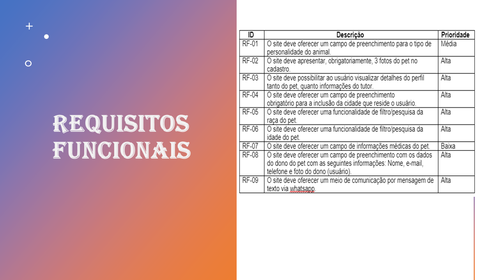

# Apresentação

Conjunto de slides em um arquivo PowerPoint ou PDF com a apresentação do projeto contemplando todos os itens trabalhados nos demais artefatos e video demosntrando as funcionalidades do projeto.

## Título do Projeto

# COUPLE PET'S

## Identidade Visual (Marca, Design)

## Conjunto de Slides (Estrutura)

Link dos slides da apresentação do projeto: 

https://sgapucminasbr.sharepoint.com/:p:/s/team_sga_2418_2022_1_5012101-Grupo1-Pets/EbZFoI-KCxtOtLAPQxVIdLMBuH5DRQ_4jz9XtNCsOpurxQ?e=MADXI7

# Vídeo da apresentação

Segue link para visualização do vídeo com a apresentação da solução:

https://youtu.be/cOdGcTN1n4A

